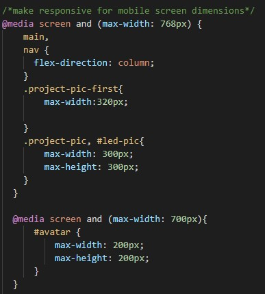

# challenge2-professional-portfolio

## Introduction

Challenge 2 is an assignment to create our own portfolio webpage. This offers a good opportunity to be creative by starting from scratch. This also makes for a great way to understand how CSS is used to pull a page together and primarily how it is responsive when viewed from a mobile device.

## Installation

To install this project, simply clone the repository:
    git clone git@github.com:Tdegirol/challenge2-professional-portfolio.git

To visit the webpage on github please follow the link below:
    https://github.com/Tdegirol/challenge2-professional-portfolio.git

To view the website please follow the link below:
    https://tdegirol.github.io/challenge2-professional-portfolio/

## Usage

This project required building our site from the bottom up. The main focuses included writing responsive code and organizing/styling a webpage with complete freedom. Getting comfortable with using flex and media queries seems to be an essential component of web development. Photo below of an example of media queries used on this project:

## Credits

Our professor and TA's! Rommel, Charlie, and Donnahue through class and office hours.

